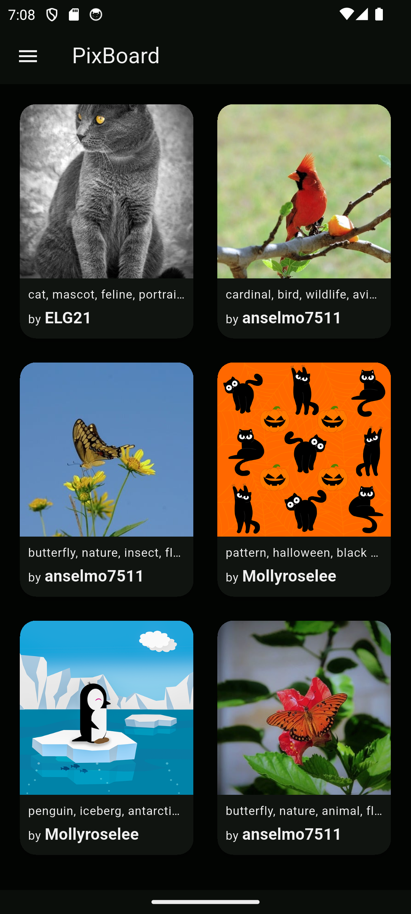
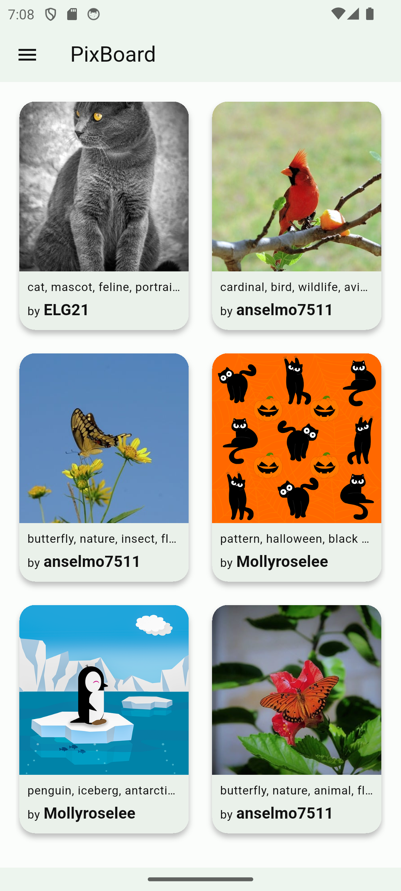
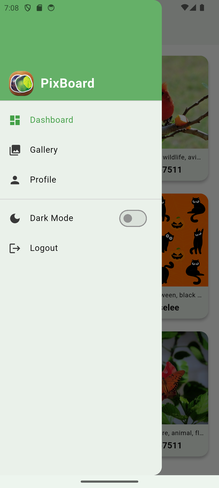
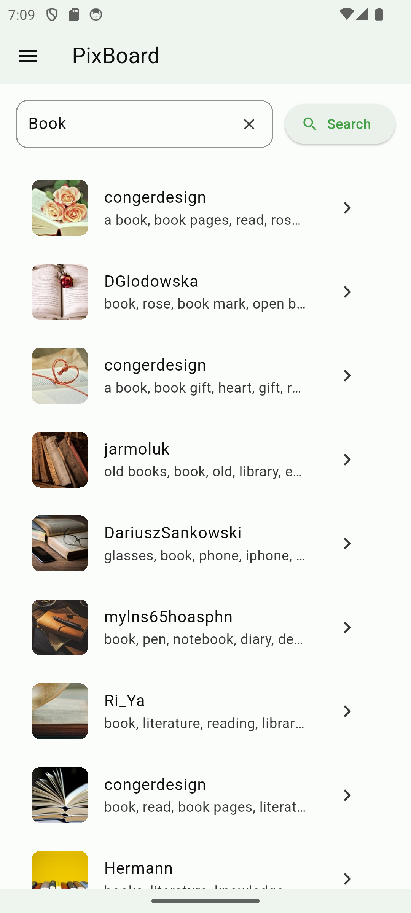
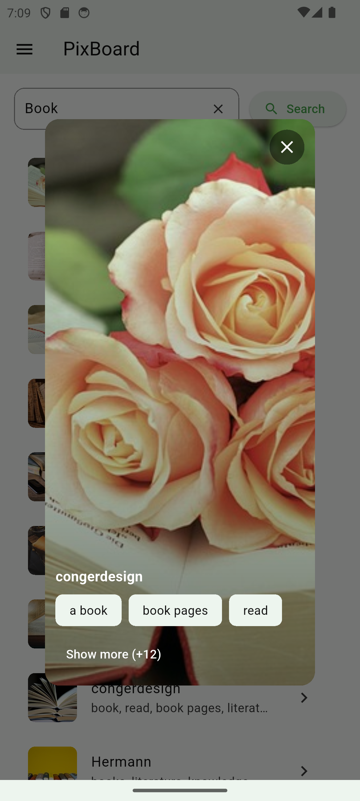
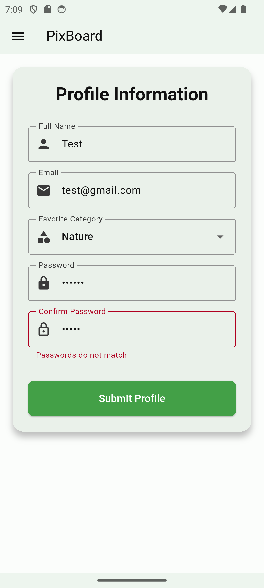
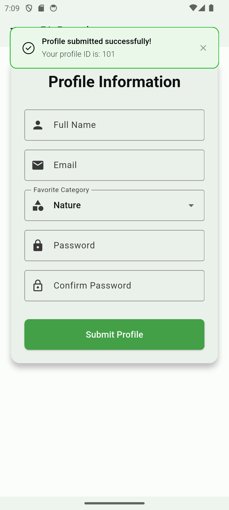
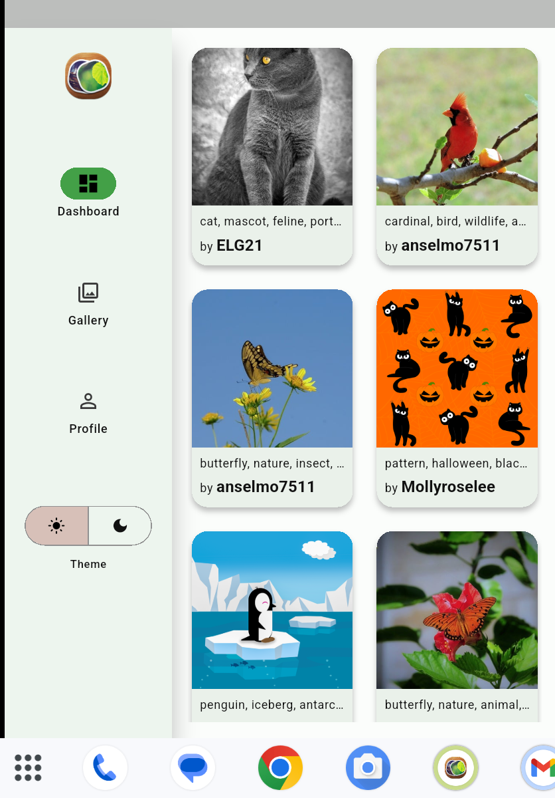
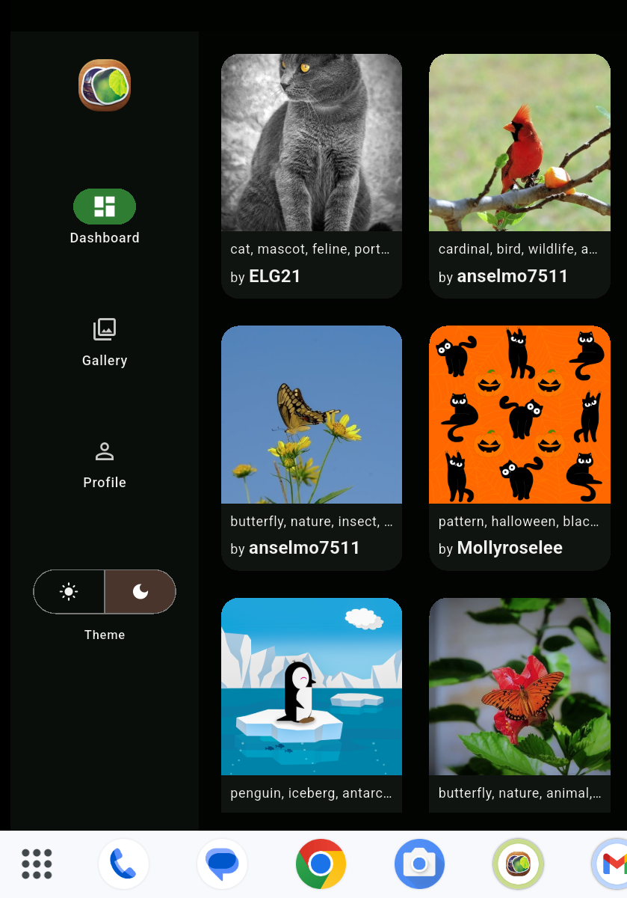

# Pixboard

Flutter App coding exercise

---
## API Endpoints
- **Pixabay Images**: `https://pixabay.com/api/` (GET)
- **Profile Submit**: `https://jsonplaceholder.typicode.com/posts` (POST)

---
## Getting Started 🚀

This project contains 3 flavors:

- development
- staging
- production

To run the desired flavor either use the launch configuration in VSCode/Android Studio or use the following commands:

```sh
# Development
$ flutter run --flavor development --target lib/main_development.dart

# Staging
$ flutter run --flavor staging --target lib/main_staging.dart

# Production
$ flutter run --flavor production --target lib/main_production.dart
```

_\*Pixboard works on iOS, Android, Web, and Windows._

---

### Screenshot
| Dashboard Dark                               | Dahboard Light                               | Drawer menu                                  |
| -------------------------------------------- | -------------------------------------------- | -------------------------------------------- |
|  |  |  |

| Gallery                                      | Gallery view                                 | Profile                                      |
| -------------------------------------------- | -------------------------------------------- | -------------------------------------------- |
|  |  |  |

| Profile Success                              | Tablet Light                                 | Tablet Dark                                  |
| -------------------------------------------- | -------------------------------------------- | -------------------------------------------- |
|  |  |  |

---

### Web version
Visit the following **[Link](https://albusaidyy.github.io/pixboard/)**.
